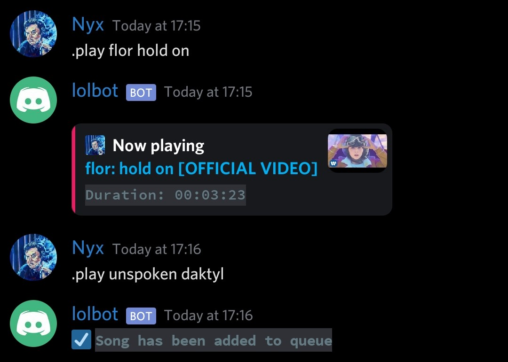
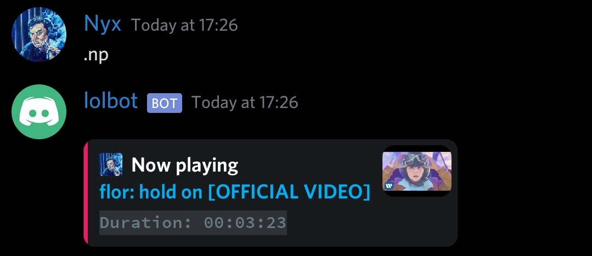
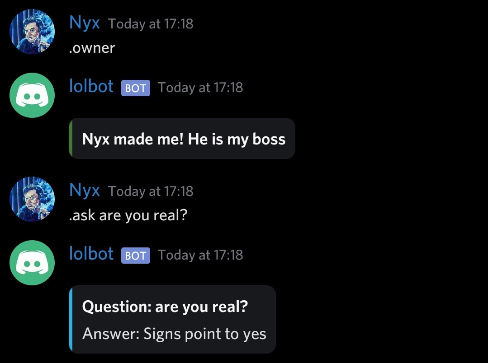
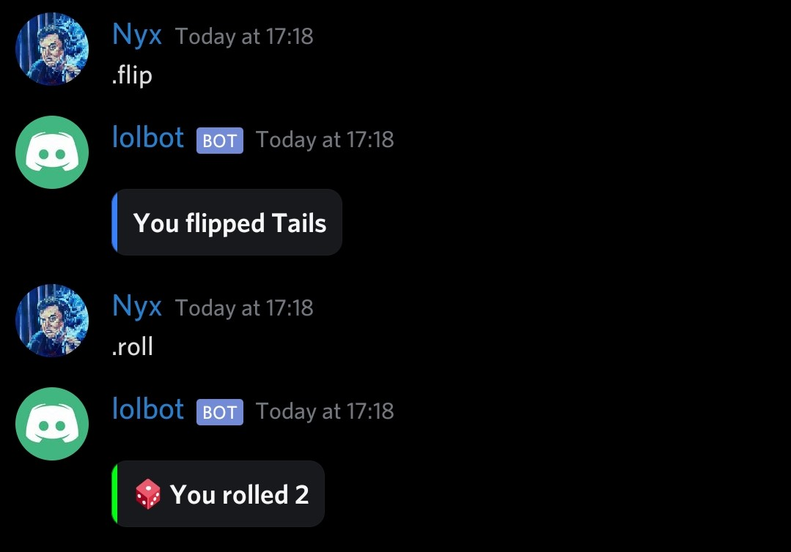
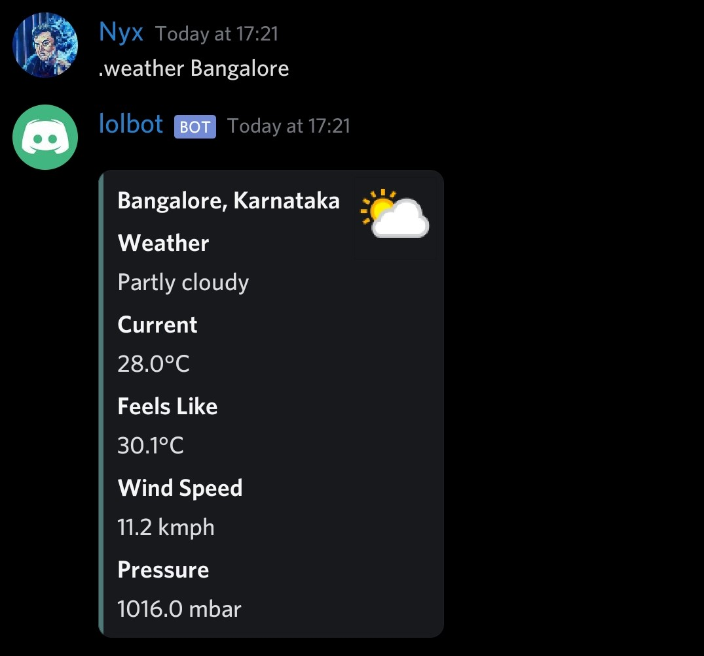
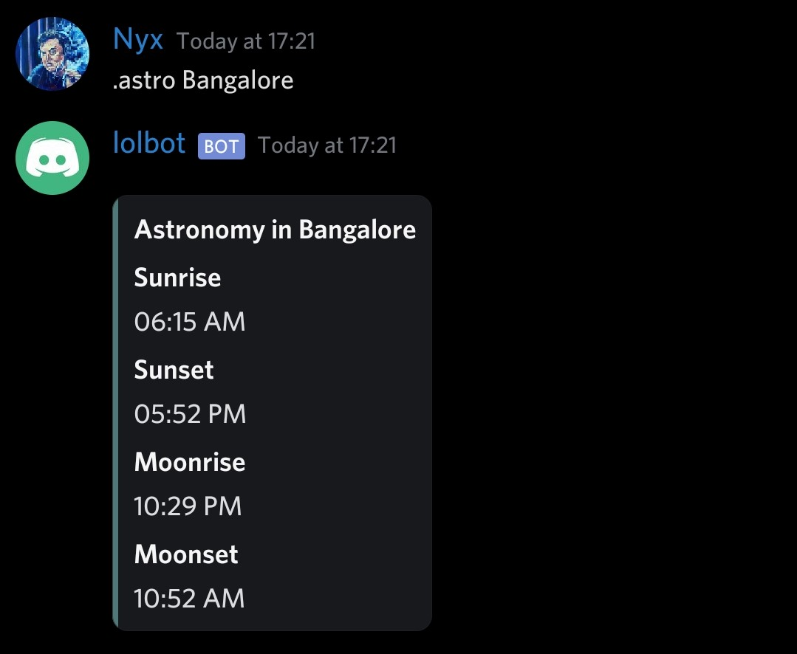
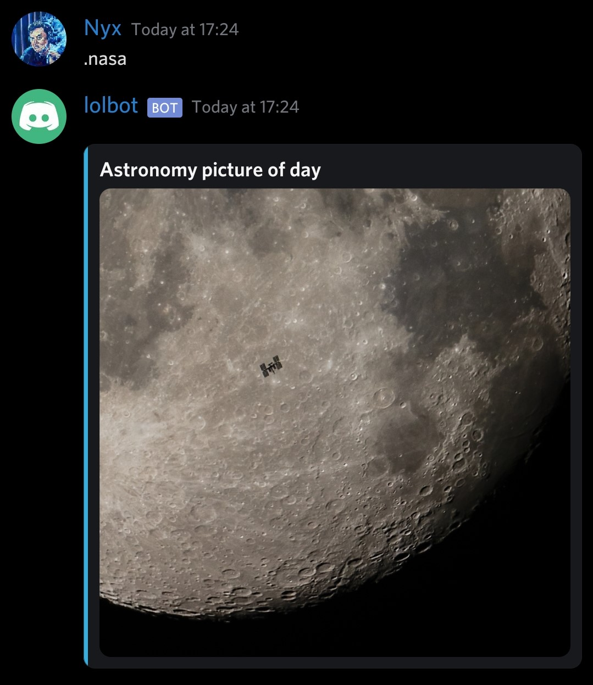
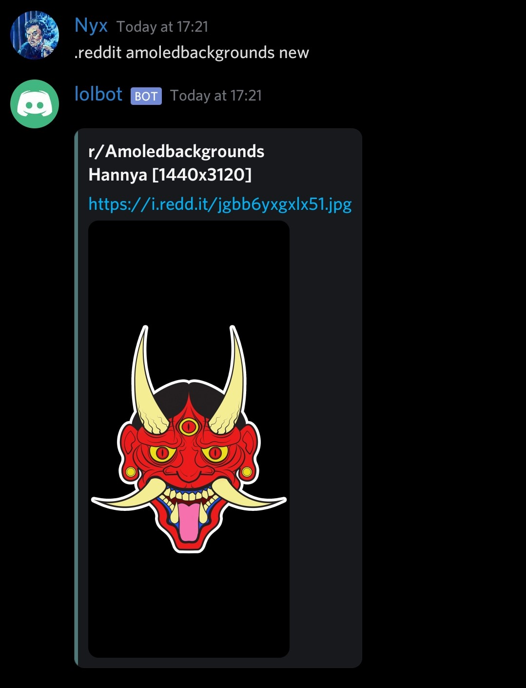
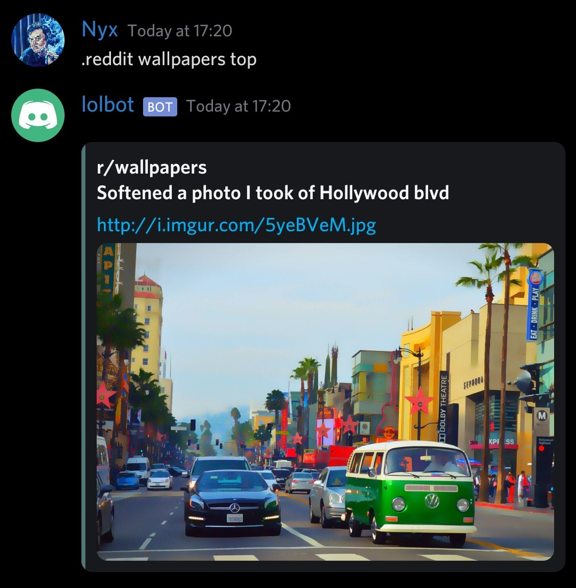
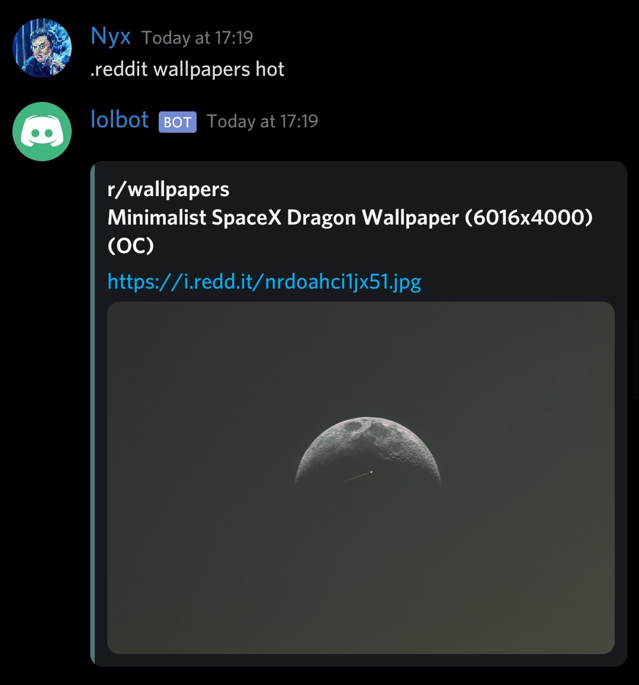

## Setup
1. Go to https://discord.com/developers/applications and create an application.  
2. Get the discord token and place it inside utils/secrets.py
3. Install ffmpeg https://ffmpeg.org/download.html#build-windows or https://github.com/BtbN/FFmpeg-Builds/releases/download/autobuild-2021-01-20-13-01/ffmpeg-N-100679-g24dc6d386c-win64-gpl-vulkan.zip

## Install dependencies
`pip install -r requirements.txt`

## How to run
`python bot.py`

## Bot commands

* `Bot prefix is '.'`
* `To use any command prefix it with '.'`  
[CHECK OUT THE COMMANDS HERE](./COMMANDS.md)

## Examples

### Music

### Questions

### Weather

### Reddit

