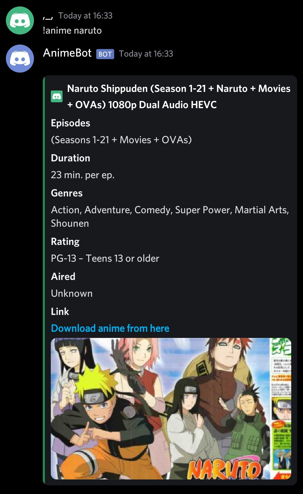

## Setup

1. Go to https://discord.com/developers/applications and create an application.
2. Get the discord token and place it inside utils/secrets.py
3. Install ffmpeg https://ffmpeg.org/download.html#build-windows or https://github.com/BtbN/FFmpeg-Builds/releases

## Install dependencies

`pip install -r requirements.txt`

## How to run

`python bot.py`

## Bot commands

- `Bot prefix is '.'`
- `To use any command prefix it with '.'`  
  [CHECK OUT THE COMMANDS HERE](./COMMANDS.md)

## Examples

### Music

### Questions

### Weather

### Reddit

### Anime

